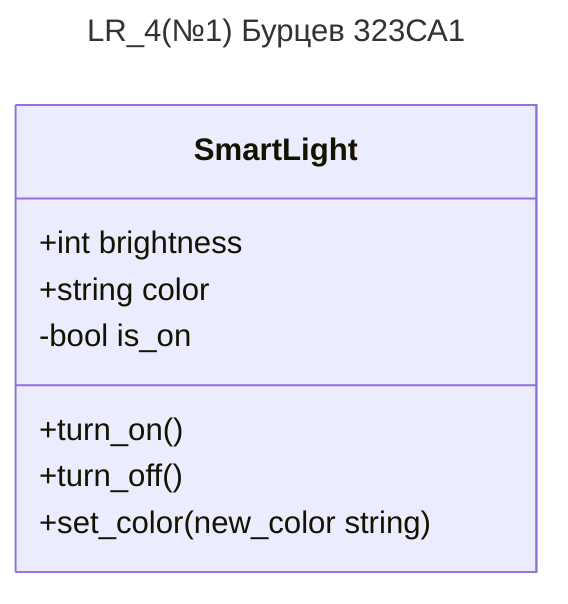
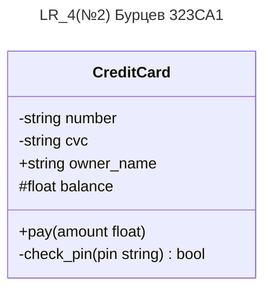
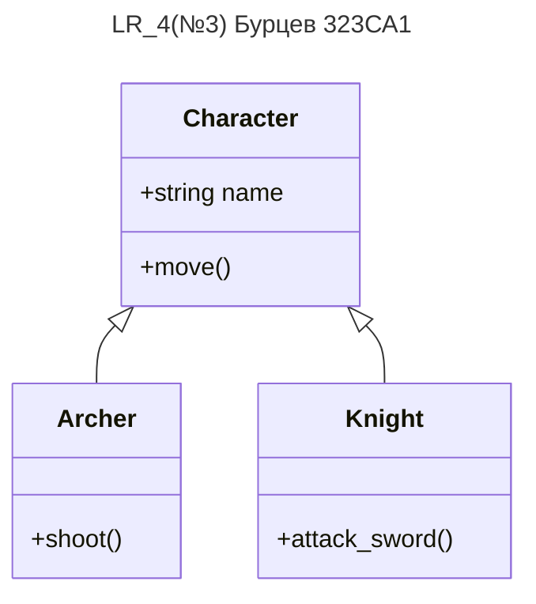
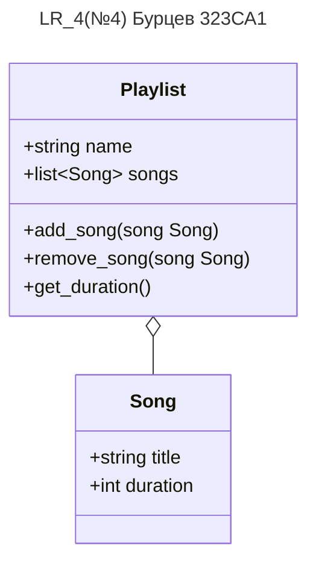
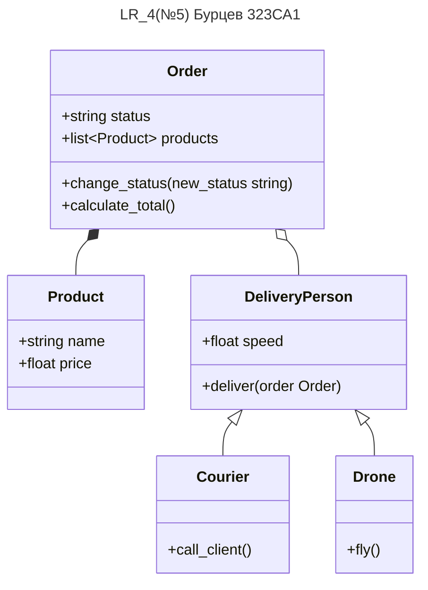
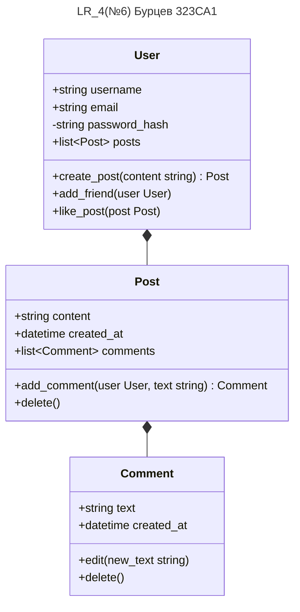

### Задание 1

```mermaid
---
title: LR_4(№1) Бурцев 323СА1
---
classDiagram
    class SmartLight {
        +int brightness
        +string color
        -bool is_on
        
        +turn_on()
        +turn_off()
        +set_color(new_color string)
    }
```
### Задание 2

```mermaid
---
title: LR_4(№2) Бурцев 323СА1
---
classDiagram
    class CreditCard {
        -string number
        -string cvc
        +string owner_name
        #float balance
        
        +pay(amount float)
        -check_pin(pin string) bool
    }
```
### Задание 3

```mermaid
---
title: LR_4(№3) Бурцев 323СА1
---
classDiagram
    class Character {
        +string name
        
        +move()
    }
    
    class Archer {
        +shoot()
    }
    
    class Knight {
        +attack_sword()
    }
    
    Character <|-- Archer
    Character <|-- Knight
```
### Задание 4

```mermaid
---
title: LR_4(№4) Бурцев 323СА1
---
classDiagram
    class Playlist {
        +string name
        +list~Song~ songs
        
        +add_song(song Song)
        +remove_song(song Song)
        +get_duration()
    }
    
    class Song {
        +string title
        +int duration
    }
    
    Playlist o-- Song
```
### Задание 5

```mermaid
---
title: LR_4(№5) Бурцев 323СА1
---
classDiagram
    class Order {
        +string status
        +list~Product~ products
        
        +change_status(new_status string)
        +calculate_total()
    }
    
    class Product {
        +string name
        +float price
    }
    
    class DeliveryPerson {
        +float speed
        
        +deliver(order Order)
    }
    
    class Courier {
        +call_client()
    }
    
    class Drone {
        +fly()
    }
    
    Order *-- Product
    DeliveryPerson <|-- Courier
    DeliveryPerson <|-- Drone
    Order o-- DeliveryPerson
```
### Задание 6

```mermaid
---
title: LR_4(№6) Бурцев 323СА1
---
classDiagram
    class User {
        +string username
        +string email
        -string password_hash
        +list~Post~ posts
        
        +create_post(content string) Post
        +add_friend(user User)
        +like_post(post Post)
    }
    
    class Post {
        +string content
        +datetime created_at
        +list~Comment~ comments
        
        +add_comment(user User, text string) Comment
        +delete()
    }
    
    class Comment {
        +string text
        +datetime created_at
        
        +edit(new_text string)
        +delete()
    }
    
    User *-- Post
    Post *-- Comment
```